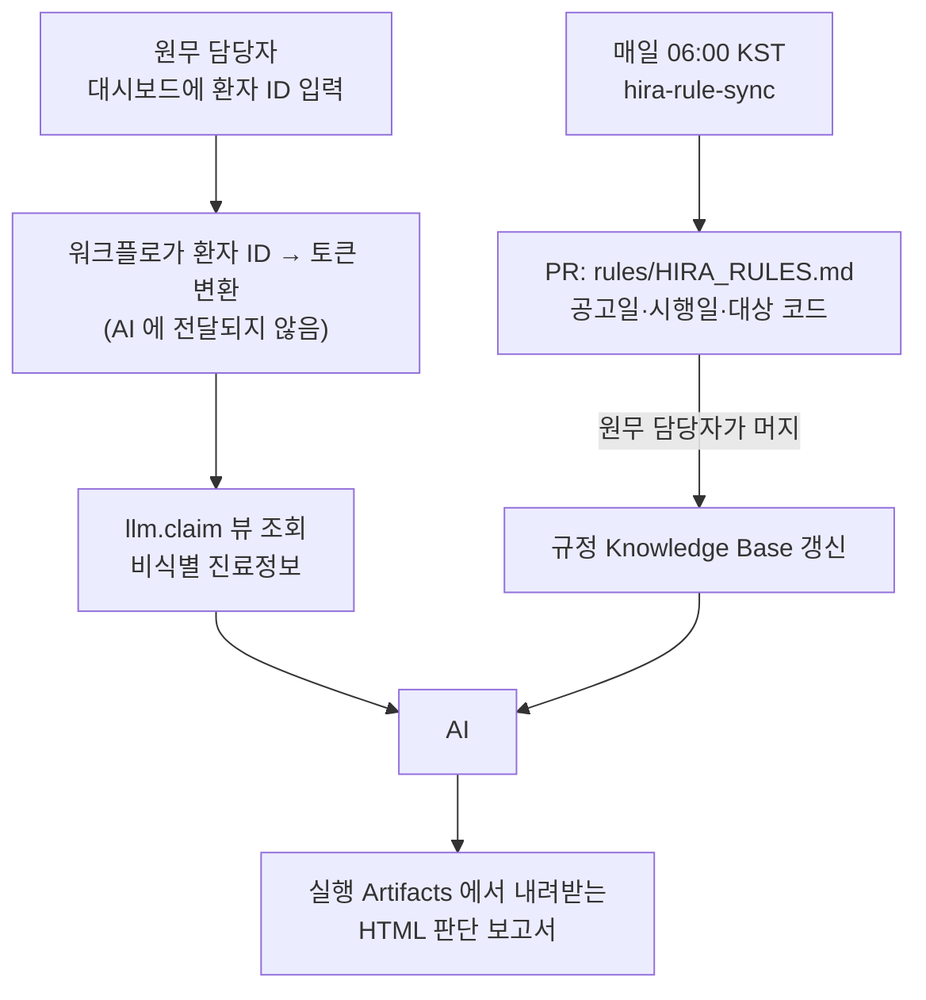

# HIRA Billing Copilot

원무부가 환자 한 명의 진료비를 확인할 때, **최신 심평원 규정과 그 환자의 진료내역을
자동으로 이어 주는** Copilot 입니다.

기존 청구 시스템을 대체하지 않습니다. 매일 바뀌는 규정을 사람이 직접 확인하고
환자 조건과 하나씩 대조하던 과정만 GitHub 위로 옮깁니다.

## 파이프라인



| 단계 | 워크플로 | 트리거 | 산출물 |
|---|---|---|---|
| 0-1. 규정 동기화 | `hira-rule-sync.md` | 매일 06:00 KST · 수동 | `rules/HIRA_RULES.md` PR |
| 0-2. 환자/진료 DB | `db/` | — | GHCR 이미지 |
| 1~3. 청구 판단 | `billing-intake.yml` → `billing-review.md` | 대시보드 · Actions · 이슈 | 실행 Artifact `billing-report` |
| 현황 대시보드 | `build-dashboard.yml` | 이미지 게시 후 · 수동 | `site/index.html` |

규정 동기화는 PR 을 만들 뿐 스스로 머지하지 않습니다. **머지가 곧 담당자의 확인입니다.**

## 판단 결과를 저장소에 남기지 않는 이유

판단 결과에는 그 환자의 진료 내용이 들어 있습니다. 이슈 댓글이나 커밋으로 남기면
저장소를 볼 수 있는 사람 모두에게 계속 남습니다. 그래서 남기지 않습니다.

`billing-review` 의 `safe-outputs` 는 `staged: true` 입니다 — AI 에게 출력 창구는
주되 이슈·PR·커밋 어디에도 게시하지 않습니다. 그 출력은 실행 안에서
`tools/render_report.py` 가 HTML 로 바꾸고, **실행 Artifacts 의 `billing-report`** 로만
내려받습니다. 아티팩트는 7일 뒤 사라집니다.

이슈로도 요청할 수 있습니다(코파일럿을 직접 붙여 모델을 고르고 싶을 때). 그때도
`billing-intake` 가 **이슈 본문과 제목의 환자 ID 를 `P****` 로 바꿔 둡니다.**
판단에 필요한 값은 이미 토큰으로 바뀐 뒤라 원본은 더 필요 없습니다.

보고서를 굽는 마지막 단계에서도 `P#####` 와 `PT_…` 를 한 번 더 가립니다.
어느 경로로든 식별값이 흘러들면 거기서 걸립니다.

## AI 에게 환자 식별정보가 가지 않는 방법

식별정보를 "AI 에게 준 뒤 가리는" 것이 아니라, **애초에 SELECT 되지 않게** 했습니다.

```
대시보드 입력창 [환자 ID]
   │
   ├──────── ✕ ────────> AI          요청 원문은 AI 에게 가지 않는다
   │
   ▼
billing-intake 단계에서 환자 ID → patient_token 변환 (앱 자격증명)
   │                     ID 는 이 단계 밖으로 나가지 않는다
   ▼
llm.claim 뷰 조회 ─────────────────> AI
   비식별 진료정보 + rules/HIRA_RULES.md
```

`patient_token` 은 `db/init.sql` 이 DB 를 만들 때 계산해 **컬럼으로 굳혀 둔** 값입니다.
`private.token('PT', patient_id)` = HMAC-SHA256 의 앞 12자이고, 비밀키는 이미지를
빌드할 때 한 번 뽑아 박습니다. 그래서 같은 이미지에서 뜬 컨테이너끼리는 토큰이 같고,
`billing-intake` 가 만든 토큰을 `billing-review` 가 그대로 씁니다.

함수가 아니라 컬럼인 이유가 있습니다. 뷰가 함수를 부르면 EXECUTE 권한을 **호출자**
에게 줘야 하고, 그러면 AI 가 `P00001`…`P00050` 을 넣어 토큰을 되짚을 수 있습니다.
컬럼으로 굳히면 함수 권한을 하나도 줄 필요가 없습니다.
ID→토큰을 돌려주는 `public.resolve_patient_token` 은 앱 자격증명만 부를 수 있습니다.

`llm_reader` 역할은 `llm.claim` 뷰 하나만 읽습니다. 아래는 **뷰에 열 자체가 없습니다.**

```
patient_id  patient_name  birth_date  mobile_phone  resident_id_token
treatment_id  encounter_id
```

나이는 진료일 기준으로 계산되어 들어가고, 생년월일은 나가지 않습니다.
환자 단위 연결이 필요한 판단(이전 치료 여부, 치료 횟수)은 `patient_token` 으로 합니다 —
이미지마다 새로 뽑는 비밀키로 HMAC 한 값이라 되짚을 수 없고, **AI 는 토큰을 받기만 하고
만들지는 못합니다**(토큰 계산 함수에 권한이 없습니다).

경계는 관례가 아니라 DB 가 강제합니다:

```
$ psql -U llm_reader -d billing

billing=> SELECT count(*) FROM claim;
 50

billing=> SELECT patient_name FROM public.patient_master;
ERROR:  permission denied for schema public

billing=> SELECT private.token('PT','P00001');
ERROR:  permission denied for schema private

billing=> CREATE TABLE probe(x int);
ERROR:  cannot execute CREATE TABLE in a read-only transaction
```

이 다섯 가지는 `db/init.sql` 끝의 게이트가 **이미지 빌드 중에** 확인합니다.
경계가 열린 이미지는 만들어지지 않습니다. `db/test-access.sh` 가 배포 전에 한 번 더 봅니다.

## 규정을 덮어쓰지 않는 이유

진료일에 따라 적용 규정이 다릅니다. 공고일과 시행일도 다릅니다.

```markdown
- 공고일: 2025-12-15
- 시행일: 2026-01-01
- 적용 기준: 2026-01-01 진료분부터
```

그래서 동기화 워크플로는 새 규정을 **추가**만 하고 기존 항목을 지우지 않습니다.
2025-12-30 진료분은 그때의 규정으로 판단해야 하기 때문입니다.

또한 **가격 변경과 조건 변경을 구분**합니다. 금액은 그대로인데 본인부담률만 바뀌거나,
금액은 그대로인데 급여 인정조건만 바뀌는 경우가 있습니다.

## 시작하기

이 저장소를 템플릿으로 새 저장소를 만든 뒤:

1. Settings → Actions → General → **Allow GitHub Actions to create and approve pull requests** 활성화
2. Actions → **publish-db-image** 를 한 번 실행
3. Settings → Pages → Source: **Deploy from a branch** → `main` / `/site` (선택)

2번이 **본인 GHCR 에** DB 이미지를 만듭니다. 워크플로는 이미지를
`ghcr.io/<본인 아이디>/hira-billing-db` 로 참조하므로, 남의 패키지에 접근 권한을
받을 일도 collaborator 를 추가할 일도 없습니다. 본인 것만 보면 됩니다.

3번은 대시보드를 웹으로 여는 것뿐입니다. 안 켜도 `site/index.html` 을 내려받아
더블클릭하면 똑같이 동작합니다.

### 대시보드에서 진료비 확인 요청하기

환자 ID 를 넣고 **진료비 확인** 을 누르면 `billing-intake` 가 돕니다.

GitHub 은 익명 요청으로 워크플로를 시작해 주지 않습니다. 그래서 두 가지 길이 있습니다.

- **토큰** 을 눌러 본인 GitHub 토큰(이 저장소에 `Actions: read and write`)을 한 번
  넣어 두면, 그 뒤로는 페이지에서 바로 실행됩니다. 토큰은 **그 브라우저에만**
  저장되고 페이지에도 저장소에도 들어가지 않습니다 — 각자 자기 토큰으로
  자기 저장소를 돌립니다. 본인 GHCR 을 쓰는 것과 같은 이유입니다.
- 토큰을 넣지 않으면 Actions 실행 화면으로 넘어갑니다. GitHub 은 실행 폼의 값을
  URL 로 미리 채워 주지 않아서, 페이지가 환자 ID 를 클립보드에 복사해 둡니다.
  붙여넣고 **Run workflow** 를 누르면 됩니다.

어느 쪽이든 결과는 실행 페이지 아래 **Artifacts → `billing-report`** 입니다.

시크릿은 없습니다. `llm_reader` 비밀번호는 이미지에 고정돼 있는데, 그 역할은
`llm.claim` 뷰 하나만 읽을 수 있어 비밀번호를 알아도 더 가져갈 게 없습니다.
경계는 비밀번호가 아니라 뷰와 권한입니다.
**실제 병원 데이터를 넣는다면** 이 값을 시크릿으로 바꾸고 포트를 열지 마세요.

### 로컬에서 DB 실행

```bash
export GHCR_OWNER=YOUR_GITHUB_ID
gh auth token | docker login ghcr.io -u "$GHCR_OWNER" --password-stdin
docker compose up -d
./db/test-access.sh          # 경계가 서 있는지 확인
```

이미지를 직접 검사하려면 `./db/test-access.sh <image>` 로도 됩니다.

### 규정 동기화 수동 실행

```bash
gh workflow run hira-rule-sync.lock.yml -f since=2026-08-01
```

## 구성

```text
.
├── .github/
│   ├── ISSUE_TEMPLATE/billing-check.yml
│   └── workflows/
│       ├── shared/billing-db.md      # DB 서비스 · query-billing-db 도구 (공용)
│       ├── hira-rule-sync.md         # 0-1: 매일 아침 규정 동기화
│       ├── billing-intake.yml        # 1~2: 환자ID를 토큰으로 → 호출 · 이슈 ID 가리기
│       ├── billing-review.md         # 3: 청구 판단 → 내려받는 HTML 보고서
│       ├── build-dashboard.yml       # 청구 현황 → site/index.html
│       └── publish-db-image.yml      # DB 이미지 → 본인 GHCR
├── db/
│   ├── Dockerfile
│   ├── init.sql                      # 2테이블 + 토큰화 + llm.claim 뷰 + llm_reader + 빌드 게이트
│   ├── test-access.sh                # 경계 검사 (compose 또는 이미지 대상)
│   └── data/                         # 환자 50명 · 진료 50건 (합성, 실제 수가코드)
├── rules/HIRA_RULES.md               # 규정 Knowledge Base (시행일 추적)
├── site/
│   ├── dashboard.template.html       # 검색 + 3컬럼: 진료일 / 청구 건 / 청구 판단
│   └── index.html                    # 빌드 산출물 (러너가 굽는다)
├── tools/
│   ├── fetch_notices.py              # 심평원 공지 수집 (방화벽 밖 steps 에서 실행)
│   ├── build_dashboard.py            # llm.claim + 규정 → site/index.html
│   └── render_report.py              # AI 판단 → 내려받는 billing-report.html
└── compose.yaml
```

`.lock.yml` 은 `gh aw compile` 이 생성합니다. 직접 고치지 말고 `.md` 를 고친 뒤
다시 컴파일하세요.

모든 판단은 원무 담당자의 확인이 필요합니다.
