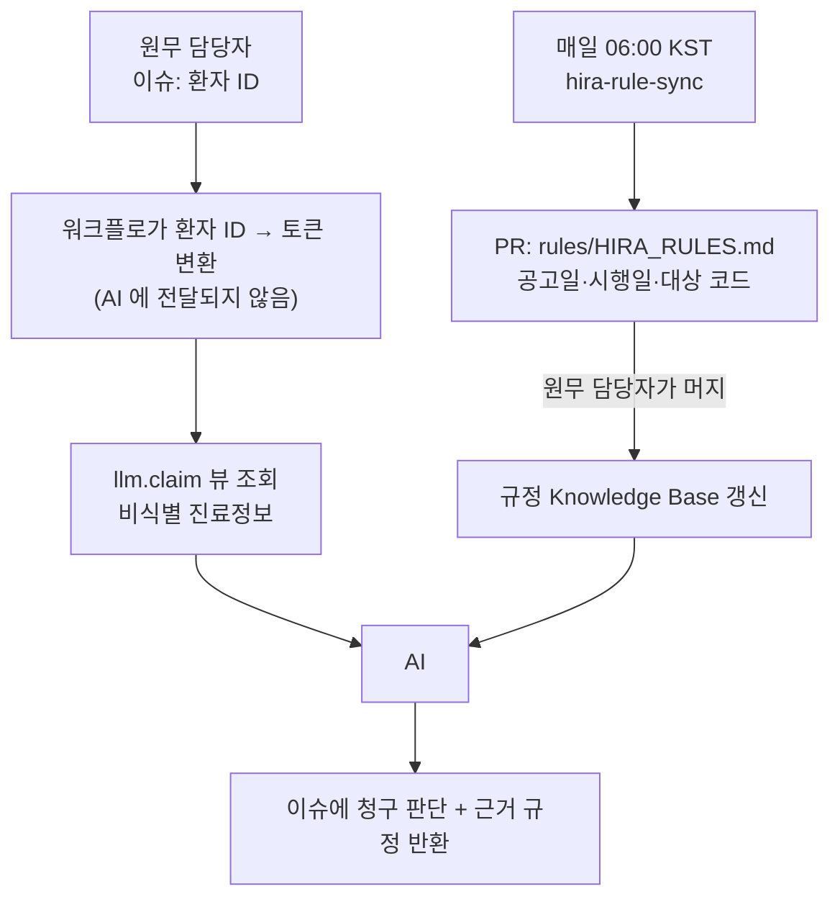

# HIRA Billing Copilot

원무부가 환자 한 명의 진료비를 확인할 때, **최신 심평원 규정과 그 환자의 진료내역을
자동으로 이어 주는** Copilot 입니다.

기존 청구 시스템을 대체하지 않습니다. 매일 바뀌는 규정을 사람이 직접 확인하고
환자 조건과 하나씩 대조하던 과정만 GitHub 위로 옮깁니다.

## 파이프라인



| 단계 | 워크플로 | 트리거 | 산출물 |
|---|---|---|---|
| 0-1. 규정 동기화 | `hira-rule-sync.md` | 매일 06:00 KST · 수동 | `rules/HIRA_RULES.md` PR |
| 0-2. 환자/진료 DB | `db/` | — | GHCR 이미지 |
| 1~3. 청구 판단 | *(다음 단계에서 구현)* | 이슈 등록 | 이슈 댓글 |

각 단계는 PR 을 만들 뿐 스스로 머지하지 않습니다. **머지가 곧 담당자의 확인입니다.**

## AI 에게 환자 식별정보가 가지 않는 방법

식별정보를 "AI 에게 준 뒤 가리는" 것이 아니라, **애초에 SELECT 되지 않게** 했습니다.

```
이슈 [환자 ID]
   │
   ├──────── ✕ ────────> AI          이슈 본문은 AI 에게 가지 않는다
   │
   ▼
워크플로 단계에서 환자 ID → patient_token 변환 (앱 자격증명)
   │
   ▼
llm.claim 뷰 조회 ─────────────────> AI
   비식별 진료정보 + rules/HIRA_RULES.md
```

`llm_reader` 역할은 `llm.claim` 뷰 하나만 읽습니다. 아래는 **뷰에 열 자체가 없습니다.**

```
patient_id  patient_name  birth_date  mobile_phone  resident_id_token
treatment_id  encounter_id
```

나이는 진료일 기준으로 계산되어 들어가고, 생년월일은 나가지 않습니다.
환자 단위 연결이 필요한 판단(이전 치료 여부, 치료 횟수)은 `patient_token` 으로 합니다 —
컨테이너마다 새로 뽑는 비밀키로 HMAC 한 값이라 되짚을 수 없고, **AI 는 토큰을 받기만 하고
만들지는 못합니다**(토큰 계산 함수에 권한이 없습니다).

경계는 관례가 아니라 DB 가 강제합니다:

```
$ psql -U llm_reader -d billing

billing=> SELECT count(*) FROM claim;
 50

billing=> SELECT patient_name FROM public.patient_master;
ERROR:  permission denied for schema public

billing=> SELECT private.token('PT','P00001');
ERROR:  permission denied for schema private

billing=> CREATE TABLE probe(x int);
ERROR:  cannot execute CREATE TABLE in a read-only transaction
```

이 다섯 가지는 `db/assert-boundary.sql` 이 **이미지 빌드 중에** 확인합니다.
경계가 열린 이미지는 만들어지지 않습니다.

## 규정을 덮어쓰지 않는 이유

진료일에 따라 적용 규정이 다릅니다. 공고일과 시행일도 다릅니다.

```markdown
- 공고일: 2025-12-15
- 시행일: 2026-01-01
- 적용 기준: 2026-01-01 진료분부터
```

그래서 동기화 워크플로는 새 규정을 **추가**만 하고 기존 항목을 지우지 않습니다.
2025-12-30 진료분은 그때의 규정으로 판단해야 하기 때문입니다.

또한 **가격 변경과 조건 변경을 구분**합니다. 금액은 그대로인데 본인부담률만 바뀌거나,
금액은 그대로인데 급여 인정조건만 바뀌는 경우가 있습니다.

## 시작하기

이 저장소를 템플릿으로 새 저장소를 만든 뒤:

1. Settings → Actions → General → **Allow GitHub Actions to create and approve pull requests** 활성화
2. GHCR 패키지 설정에서 새 저장소에 Actions 접근 권한 부여

시크릿은 없습니다. `llm_reader` 비밀번호는 이미지에 고정돼 있는데, 그 역할은
`llm.claim` 뷰 하나만 읽을 수 있어 비밀번호를 알아도 더 가져갈 게 없습니다.
경계는 비밀번호가 아니라 뷰와 권한입니다.
**실제 병원 데이터를 넣는다면** 이 값을 시크릿으로 바꾸고 포트를 열지 마세요.

### 로컬에서 DB 실행

```bash
gh auth token | docker login ghcr.io -u YOUR_GITHUB_ID --password-stdin
docker compose up -d
./db/test-access.sh          # 경계가 서 있는지 확인
```

이미지를 직접 검사하려면 `./db/test-access.sh <image>` 로도 됩니다.

### 규정 동기화 수동 실행

```bash
gh workflow run hira-rule-sync.lock.yml -f since=2026-08-01
```

## 구성

```text
.
├── .github/
│   ├── ISSUE_TEMPLATE/billing-check.yml
│   └── workflows/
│       ├── shared/billing-db.md      # DB 서비스 · query-billing-db 도구 (공용)
│       ├── hira-rule-sync.md         # 0-1: 매일 아침 규정 동기화
│       └── publish-db-image.yml      # DB 이미지 → GHCR
├── db/
│   ├── Dockerfile
│   ├── init.sql                      # 2테이블 + 토큰화 + llm.claim 뷰 + llm_reader + 빌드 게이트
│   ├── test-access.sh                # 경계 검사 (compose 또는 이미지 대상)
│   └── data/                         # 환자 50명 · 진료 50건 (합성, 실제 수가코드)
├── rules/HIRA_RULES.md               # 규정 Knowledge Base (시행일 추적)
└── compose.yaml
```

`.lock.yml` 은 `gh aw compile` 이 생성합니다. 직접 고치지 말고 `.md` 를 고친 뒤
다시 컴파일하세요.

모든 판단은 원무 담당자의 확인이 필요합니다.
