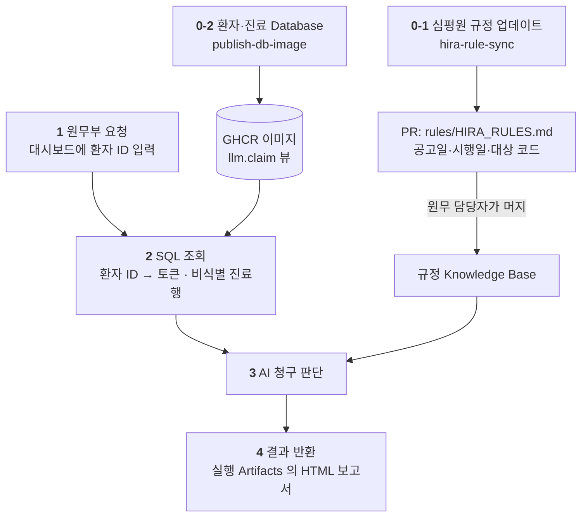

# HIRA Billing Copilot

원무부가 환자 한 명의 진료비를 확인할 때, **최신 심평원 규정과 그 환자의 진료내역을
자동으로 이어 주는** Copilot 입니다.

기존 청구 시스템을 대체하지 않습니다. 매일 바뀌는 규정을 사람이 직접 확인하고
환자 조건과 하나씩 대조하던 과정만 GitHub 위로 옮깁니다.

## 파이프라인



| 단계 | 하는 일 | 구현 | 트리거 | 산출물 |
|---|---|---|---|---|
| **0-1** | 심평원 규정 업데이트 | `hira-rule-sync.md` · `tools/fetch_notices.py` | 매일 06:00 KST · 수동 | `rules/HIRA_RULES.md` PR |
| **0-2** | 환자 / 진료 Database | `db/init.sql` · `db/Dockerfile` | `publish-db-image` 수동 1회 | GHCR 이미지 |
| **1** | 원무부 요청 | `site/index.html` → `billing-intake.yml` | 검색창에 환자 ID · Enter | `workflow_dispatch` 실행 |
| **2** | SQL 조회 | `billing-intake.yml` · `shared/billing-db.md` | 1 에 이어서 | `patient_token` · 비식별 진료행 |
| **3** | AI 청구 판단 | `billing-review.md` | 2 가 호출 | 판단 마크다운 (게시 안 함) |
| **4** | 결과 반환 | `tools/render_report.py` (post-steps) | 3 직후 | 실행 Artifact `billing-report` → 화면에 표시 |
| **—** | 요청 화면 | `build-dashboard.yml` · `tools/build_dashboard.py` | 이미지 게시 후 · 수동 | `site/index.html` · Pages |

### 단계별로 무슨 일이 일어나나

**0-1 — 심평원 규정 업데이트.** 매일 새벽 심평원 공지사항을 훑어 청구에 닿는 변경만
골라 `rules/HIRA_RULES.md` 에 **추가하는** PR 을 엽니다. 기존 항목은 지우지 않습니다.
수집은 방화벽 밖 `steps:` 에서 파이썬이 하고, 무엇이 우리 청구에 닿는지 고르는 판단만
AI 가 합니다. 접속 자체가 실패하면 조용히 넘어가지 않고 알립니다.

**0-2 — 환자 / 진료 Database.** 테이블 두 개(`patient_master`, `treatment_claim`)와
비식별 뷰 `llm.claim`, 그 뷰 하나만 읽는 `llm_reader` 역할까지 `db/init.sql` 하나에
들어 있습니다. 이미지를 빌드할 때 경계 게이트가 돌아, 식별 열이 뷰에 새어 든 이미지는
아예 만들어지지 않습니다.

**1 — 원무부 요청.** 화면 가운데 검색창에 환자 ID 를 넣고 Enter 를 칩니다.
페이지가 `billing-intake` 를 `workflow_dispatch` 로 부르고, 그 자리에서 진행을 보여 줍니다.
Actions 화면으로 넘기지 않습니다 — 넘기면 같은 값을 두 번 입력하게 됩니다.
저장소에는 아무것도 남지 않습니다.

**2 — SQL 조회.** 환자 ID 는 `billing-intake` 안에서 앱 자격증명으로
`patient_token` 이 되고 **거기서 끝납니다.** 이어서 AI 는 `query-billing-db` 로
`llm.claim` 뷰만 조회합니다 — 이름·생년월일·환자 ID 는 뷰에 열 자체가 없습니다.

**3 — AI 청구 판단.** 진료건마다 `rules/HIRA_RULES.md` 와 대조해
**급여 인정 / 조건부 / 불인정** 을 가릅니다. 이때 **진료일이 시행일 이후인지** 를
먼저 봅니다. 금액은 산술로 검산하되 **고쳐 쓰지 않고 어긋났다고 보고합니다.**

**4 — 결과 반환.** 판단 결과는 이슈·PR·커밋 어디에도 게시되지 않습니다.
같은 실행 안에서 `render_report.py` 가 HTML 로 굽고, 실행 Artifacts 의
`billing-report` 로만 내려받습니다. 7일 뒤 사라집니다.
요청을 보낸 화면은 실행이 끝나기를 기다렸다가 그 파일을 받는 버튼을 띄웁니다 —
사람이 실행 페이지를 찾아 들어갈 일이 없습니다.

규정 동기화(0-1)는 PR 을 만들 뿐 스스로 머지하지 않습니다.
**머지가 곧 담당자의 확인입니다.**

## 판단 결과를 저장소에 남기지 않는 이유

판단 결과에는 그 환자의 진료 내용이 들어 있습니다. 이슈 댓글이나 커밋으로 남기면
저장소를 볼 수 있는 사람 모두에게 계속 남습니다. 그래서 남기지 않습니다.

`safe-outputs` 는 gh aw 가 AI 의 쓰기를 다루는 방식입니다. 에이전트에게 저장소
쓰기 권한을 주지 않고, "이슈를 이렇게 만들어 달라" 는 **요청을 파일로 적게** 한 뒤,
권한을 가진 별도 잡이 그 파일을 검사하고 대신 수행합니다. 프롬프트가 오염돼도
에이전트가 직접 손댈 수 있는 것이 없습니다.

`billing-review` 는 그 마지막 수행까지 끕니다 — `staged: true` 는 "만들되 게시하지
않는다" 는 뜻입니다. AI 에게 출력 창구는 주되 이슈·PR·커밋 어디에도 남기지 않고,
적힌 내용만 가져다 씁니다. 창구로 `create-issue` 를 쓰는 이유는 붙일 대상이 필요
없어서입니다 — `add-comment` 는 이슈 번호를 요구하는데 여기엔 이슈가 없습니다.

그 출력은 실행 안에서 `tools/render_report.py` 가 HTML 로 바꾸고,
**실행 Artifacts 의 `billing-report`** 로만 내려받습니다. 7일 뒤 사라집니다.

요청도 저장소에 남기지 않습니다. 이슈로 받던 길이 있었는데 걷어냈습니다 —
요청이 이슈로 들어오면 환자 번호가 저장소에 남고, 그걸 지우는 단계를 또 붙여야
했습니다. 애초에 안 남기는 편이 낫습니다. 지금은 대시보드에서 넣은 환자 ID 가
`billing-intake` 안에서 토큰으로 바뀌고 거기서 끝납니다.

보고서를 굽는 마지막 단계에서도 `P#####` 와 `PT_…` 를 한 번 더 가립니다.
어느 경로로든 식별값이 흘러들면 거기서 걸립니다.

gh aw 는 에이전트의 출력을 한 번 더 검사합니다(threat detection). 여기서 무언가
걸리면 **gh aw 가 `[aw] Detection Runs` 이슈를 열어 그 실행 링크를 적습니다** —
저장소에 남는 것은 이것 하나뿐이고, 진료 내용이나 환자 값은 들어가지 않습니다.
꺼야 한다면 `safe-outputs.threat-detection.enabled: false` 이지만, 유출을 잡는 검사를
기록이 남는다는 이유로 끄는 것은 바꿔치기가 나쁩니다. 켜 두는 쪽을 권합니다.

## AI 에게 환자 식별정보가 가지 않는 방법

식별정보를 "AI 에게 준 뒤 가리는" 것이 아니라, **애초에 SELECT 되지 않게** 했습니다.

```
대시보드 입력창 [환자 ID]
   │
   ├──────── ✕ ────────> AI          요청 원문은 AI 에게 가지 않는다
   │
   ▼
billing-intake 단계에서 환자 ID → patient_token 변환 (앱 자격증명)
   │                     ID 는 이 단계 밖으로 나가지 않는다
   ▼
llm.claim 뷰 조회 ─────────────────> AI
   비식별 진료정보 + rules/HIRA_RULES.md
```

`patient_token` 은 `db/init.sql` 이 DB 를 만들 때 계산해 **컬럼으로 굳혀 둔** 값입니다.
`private.token('PT', patient_id)` = HMAC-SHA256 의 앞 12자이고, 비밀키는 이미지를
빌드할 때 한 번 뽑아 박습니다. 그래서 같은 이미지에서 뜬 컨테이너끼리는 토큰이 같고,
`billing-intake` 가 만든 토큰을 `billing-review` 가 그대로 씁니다.

함수가 아니라 컬럼인 이유가 있습니다. 뷰가 함수를 부르면 EXECUTE 권한을 **호출자**
에게 줘야 하고, 그러면 AI 가 `P00001`…`P00050` 을 넣어 토큰을 되짚을 수 있습니다.
컬럼으로 굳히면 함수 권한을 하나도 줄 필요가 없습니다.
ID→토큰을 돌려주는 `public.resolve_patient_token` 은 앱 자격증명만 부를 수 있습니다.

`llm_reader` 역할은 `llm.claim` 뷰 하나만 읽습니다. 아래는 **뷰에 열 자체가 없습니다.**

```
patient_id  patient_name  birth_date  mobile_phone  resident_id_token
treatment_id  encounter_id
```

나이는 진료일 기준으로 계산되어 들어가고, 생년월일은 나가지 않습니다.
환자 단위 연결이 필요한 판단(이전 치료 여부, 치료 횟수)은 `patient_token` 으로 합니다 —
이미지마다 새로 뽑는 비밀키로 HMAC 한 값이라 되짚을 수 없고, **AI 는 토큰을 받기만 하고
만들지는 못합니다**(토큰 계산 함수에 권한이 없습니다).

경계는 관례가 아니라 DB 가 강제합니다:

```
$ psql -U llm_reader -d billing

billing=> SELECT count(*) FROM claim;
 50

billing=> SELECT patient_name FROM public.patient_master;
ERROR:  permission denied for schema public

billing=> SELECT private.token('PT','P00001');
ERROR:  permission denied for schema private

billing=> CREATE TABLE probe(x int);
ERROR:  cannot execute CREATE TABLE in a read-only transaction
```

이 다섯 가지는 `db/init.sql` 끝의 게이트가 **이미지 빌드 중에** 확인합니다.
경계가 열린 이미지는 만들어지지 않습니다. `db/test-access.sh` 가 배포 전에 한 번 더 봅니다.

## 규정을 덮어쓰지 않는 이유

진료일에 따라 적용 규정이 다릅니다. 공고일과 시행일도 다릅니다.

```markdown
- 공고일: 2025-12-15
- 시행일: 2026-01-01
- 적용 기준: 2026-01-01 진료분부터
```

그래서 동기화 워크플로는 새 규정을 **추가**만 하고 기존 항목을 지우지 않습니다.
2025-12-30 진료분은 그때의 규정으로 판단해야 하기 때문입니다.

또한 **가격 변경과 조건 변경을 구분**합니다. 금액은 그대로인데 본인부담률만 바뀌거나,
금액은 그대로인데 급여 인정조건만 바뀌는 경우가 있습니다.

## 시작하기

이 저장소를 템플릿으로 새 저장소를 만든 뒤:

1. Settings → Actions → General → **Allow GitHub Actions to create and approve pull requests** 활성화
2. Actions → **publish-db-image** 를 한 번 실행
3. Settings → Pages → Source: **GitHub Actions** (선택)

2번이 **본인 GHCR 에** DB 이미지를 만듭니다. 워크플로는 이미지를
`ghcr.io/<본인 아이디>/hira-billing-db` 로 참조하므로, 남의 패키지에 접근 권한을
받을 일도 collaborator 를 추가할 일도 없습니다. 본인 것만 보면 됩니다.

3번은 요청 화면을 웹으로 여는 것입니다. 화면이 곧 입구이므로 켜는 쪽을 권합니다.
안 켜도 `site/index.html` 을 내려받아 더블클릭하면 똑같이 동작합니다 — 켜지 않으면 `build-dashboard` 의 배포 잡만
건너뜁니다(대시보드는 그대로 커밋됩니다).

Pages 사이트는 **인터넷에 공개됩니다.** 올라가는 값은 `llm.claim` 뷰에서 온
비식별 합성 데이터뿐이고 환자 이름·ID·생년월일은 뷰에 열 자체가 없지만,
**실제 병원 데이터를 넣는다면 Pages 를 끄십시오.**

### 화면에서 진료비 확인 요청하기

화면은 검색창 하나입니다. 환자 ID 를 넣고 Enter 를 치면 그 자리에서 진행이 보입니다.

```text
요청 보냄  →  환자 확인 · 토큰 변환  →  규정 대조 · AI 판단  →  보고서
```

단계마다 실행 링크가 붙고, 끝나면 **보고서 내려받기** 버튼이 뜹니다.
모델과 진료일도 검색창 아래에서 고릅니다 — Actions 실행 폼을 다시 채울 일이 없습니다.

**토큰은 한 번 넣습니다.** GitHub 은 익명 요청으로 워크플로를 시작해 주지 않습니다.
왼쪽 아래 **연결 설정** 에서 본인 토큰(이 저장소에 `Actions: Read and write`)을
넣어 두면 그 뒤로는 검색창만 씁니다. 토큰은 **그 브라우저에만** 저장되고 페이지에도
저장소에도 들어가지 않습니다 — 각자 자기 토큰으로 자기 저장소를 돌립니다.
본인 GHCR 을 쓰는 것과 같은 이유입니다.

받는 파일은 zip 이고 안에 HTML 하나가 들어 있습니다. 화면이 그 자리에서 풀어 보여
주려 시도하지만 대개는 못 합니다 — GitHub 이 아티팩트 주소를 다른 호스트로 넘기고,
브라우저는 인증 헤더가 붙은 요청의 리다이렉트를 막습니다. 그때는 내려받는 버튼을 줍니다.

최근에 조회한 환자 ID 는 왼쪽 **최근** 에 남습니다. 그 브라우저에만 남고, 누르면 바로
다시 조회합니다. **연결 설정 → 최근 기록 지우기** 로 지웁니다.

**청구 데이터 훑어보기** 는 참고용입니다. AI 가 보는 것과 같은 비식별 데이터를 규정과
대조해 둔 화면이고, 진료일과 시행일 비교·금액 검산은 AI 가 아니라 여기서 계산합니다.
AI 의 판단을 검증할 때 봅니다.

### 판단에 쓸 모델 고르기

검색창 아래 드롭다운(또는 Actions 실행 폼의 **model**)에서 고릅니다.
`billing-intake` 가 그 값을 `billing-review` 로 넘기고, `billing-review` 의
최상위 `model:` 이 그대로 받습니다.

| 값 | 뜻 |
|---|---|
| `auto` (기본) | Copilot 이 알아서 고릅니다. 어떤 요금제에서든 돕니다 |
| `sonnet` · `opus` · `haiku` | Claude 계열 |
| `gpt-5` | OpenAI 계열 |
| `gemini-pro` | Google 계열 |

`auto` 외의 값은 **요금제에 따라 거절될 수 있습니다.** 거절되면 그 실행이
실패하므로, 되는 것을 확인한 뒤에 쓰세요.

시크릿은 없습니다. `llm_reader` 비밀번호는 이미지에 고정돼 있는데, 그 역할은
`llm.claim` 뷰 하나만 읽을 수 있어 비밀번호를 알아도 더 가져갈 게 없습니다.
경계는 비밀번호가 아니라 뷰와 권한입니다.
**실제 병원 데이터를 넣는다면** 이 값을 시크릿으로 바꾸고 포트를 열지 마세요.

### 로컬에서 DB 실행

```bash
export GHCR_OWNER=YOUR_GITHUB_ID
gh auth token | docker login ghcr.io -u "$GHCR_OWNER" --password-stdin
docker compose up -d
./db/test-access.sh          # 경계가 서 있는지 확인
```

이미지를 직접 검사하려면 `./db/test-access.sh <image>` 로도 됩니다.

### 규정 동기화 수동 실행

```bash
gh workflow run hira-rule-sync.lock.yml -f since=2026-08-01
```

## 구성

```text
.
├── .github/
│   └── workflows/
│       ├── shared/billing-db.md      # DB 서비스 · query-billing-db 도구 (공용)
│       ├── hira-rule-sync.md         # 0-1: 매일 아침 규정 동기화
│       ├── billing-intake.yml        # 1~2: 환자ID를 토큰으로 → 호출
│       ├── billing-review.md         # 3: 청구 판단 → 내려받는 HTML 보고서
│       ├── build-dashboard.yml       # 청구 현황 → site/index.html
│       └── publish-db-image.yml      # DB 이미지 → 본인 GHCR
├── db/
│   ├── Dockerfile
│   ├── init.sql                      # 2테이블 + 토큰화 + llm.claim 뷰 + llm_reader + 빌드 게이트
│   ├── test-access.sh                # 경계 검사 (compose 또는 이미지 대상)
│   └── data/                         # 환자 50명 · 진료 50건 (합성, 실제 수가코드)
├── rules/HIRA_RULES.md               # 규정 Knowledge Base (시행일 추적)
├── site/
│   ├── dashboard.template.html       # 검색창 + 진행 표시 + 청구 데이터 훑어보기
│   └── index.html                    # 빌드 산출물 (러너가 굽는다)
├── tools/
│   ├── fetch_notices.py              # 심평원 공지 수집 (방화벽 밖 steps 에서 실행)
│   ├── build_dashboard.py            # llm.claim + 규정 → site/index.html
│   └── render_report.py              # AI 판단 → 내려받는 billing-report.html
└── compose.yaml
```

`.lock.yml` 은 `gh aw compile` 이 생성합니다. 직접 고치지 말고 `.md` 를 고친 뒤
다시 컴파일하세요.

모든 판단은 원무 담당자의 확인이 필요합니다.
